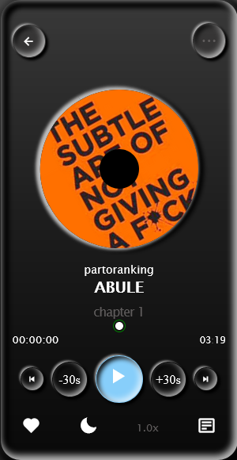

# Music app

This is portable music app for limited music (https://www.frontendmentor.io/challenges/ecommerce-product-page-UPsZ9MJp6).A project build to improve and practice my learning

## Table of contents

- [Overview](#overview)
  - [The challenge](#the-challenge)
  - [Screenshot](#screenshot)
  - [Links](#links)
- [My process](#my-process)
  - [Built with](#built-with)
  - [What I learned](#what-i-learned)
  - [Continued development](#continued-development)
  - [Useful resources](#useful-resources)
- [Author](#author)
- [Acknowledgments](#acknowledgments)

**Note: Delete this note and update the table of contents based on what sections you keep.**

## Overview

### Project name

- #### Rick boom music

### Problems

- energy power supply was not stable
- dealing with alot of bugs
- cross-platform css design, where by some certain prefix are needed just for the app to work properly on all browser

### Goals

#### Here are some of main goals of this project

- play music instantly after the page loads
- The music image should rotate as the music plays and paused while on pause
- The current time to increase by 30 seconds while the particular button is pressed and vice versa
- The heart icon should toggle the favorite music
- The range should track the music time movement

### Screenshot



### Links

- Solution URL: [Add solution URL here](https://your-solution-url.com)
- Live Site URL: [Add live site URL here](https://your-live-site-url.com)

## My process

### Built with

- Semantic HTML5 markup
- CSS custom properties
- Flexbox

**Note: These are just examples. Delete this note and replace the list above with your own choices**

### What I learned

Using the cross-browser prefixes on input .
learn how to use javascript to control audio in the web browser ,and identifying the audio object in the DOM.
learn some new CSS properties that are really useful in controlling the rolling disc

````CSS
.track-img .pause{
        animation-play-state: paused;


    }
    - to edit or overwrite the default style of an input range and makes it work in the cross-browser

    #range::-webkit-slider-thumb{
        -webkit-appearance: none;
        outline: 1px solid green;
            outline-offset: 2px;
    }
    #range::-webkit-slider-thumb{
        -webkit-appearance: none;
    }
    #range::-ms-track{
        width: 100%;
        background: transparent;
        border: 0;
    }

```javascript

working with the audio object in the DOM

to play the music audio.play() and audio.pause() to pause the music

to get all the object properties : console.dir(audio)

Use this section to recap over some of your major learnings while working through this project. Writing these out and providing code samples of areas you want to highlight is a great way to reinforce your own knowledge.

To see how you can add code snippets, see below:

```html
<h1>Some HTML code I'm proud of</h1>
````

```css
.proud-of-this-css {
	color: papayawhip;
}
```

```js
const proudOfThisFunc = () => {
	console.log("🎉");
};
```

If you want more help with writing markdown, we'd recommend checking out [The Markdown Guide](https://www.markdownguide.org/) to learn more.

**Note: Delete this note and the content within this section and replace with your own learnings.**

### Continued development

Use this section to outline areas that you want to continue focusing on in future projects. These could be concepts you're still not completely comfortable with or techniques you found useful that you want to refine and perfect.

**Note: Delete this note and the content within this section and replace with your own plans for continued development.**

### Useful resources

- [Example resource 1](https://www.example.com) - This helped me for XYZ reason. I really liked this pattern and will use it going forward.
- [Example resource 2](https://www.example.com) - This is an amazing article which helped me finally understand XYZ. I'd recommend it to anyone still learning this concept.

**Note: Delete this note and replace the list above with resources that helped you during the challenge. These could come in handy for anyone viewing your solution or for yourself when you look back on this project in the future.**

## Author

- Website - [Add your name here](https://www.your-site.com)
- Frontend Mentor - [@yourusername](https://www.frontendmentor.io/profile/yourusername)
- Twitter - [@yourusername](https://www.twitter.com/yourusername)

**Note: Delete this note and add/remove/edit lines above based on what links you'd like to share.**

## Acknowledgments

This is where you can give a hat tip to anyone who helped you out on this project. Perhaps you worked in a team or got some inspiration from someone else's solution. This is the perfect place to give them some credit.

**Note: Delete this note and edit this section's content as necessary. If you completed this challenge by yourself, feel free to delete this section entirely.**
